<div align="center">


**Dashboard interativo para monitoramento e comparação de preços de supermercados em Uberlândia com coleta automatizada diária via GitHub Actions.**

[](https://price-detector.streamlit.app)

</div>

---

> **Dados Simulados:** Atenção! Este projeto utiliza dados gerados artificialmente para fins acadêmicos e demonstração técnica. Não há coleta real de preços em supermercados. Os valores são simulados com variação aleatória, fator inflacionário e probabilidade de promoção.

---

## Contexto

Este projeto nasceu como continuação natural de uma [pesquisa de mercado sobre hábitos de compra](https://github.com/jeeescaribeiro-code/analise-habitos-compra): a pesquisa mostrou que preço é o fator número 1 na escolha do supermercado. Nesse sentido, o PriceDetection surge como uma ferramenta que mostra uma simulação de como seria a resolução desse problema. O projeto foi desenvolvido em 5 etapas (notebooks), partindo da modelagem do banco de dados até o deploy e automatização com GitHub Action.

---

## O que teremos?



| Página | O que faz |
|---|---|
|**Buscar Produto** | Compara preços do dia entre os 5 supermercados monitorados e aponta onde comprar mais barato |
|**Histórico de Preços** | Exibe a evolução do preço ao longo de até 30 dias, com média móvel de 7 dias |
|**Comparar Lista** | Simula uma lista de compras e rankeia qual supermercado sai mais barato no total |
|**Promoções de Hoje** | Detecta automaticamente produtos com queda de preço acima de 5% em relação ao dia anterior |

---

## Arquitetura



---

## Modelo de Dados

```sql
categorias   ──< produtos >──< precos >── supermercados
```

- **categorias** : Grãos, Laticínios, Carnes, Higiene, Limpeza, Óleos
- **supermercados** : Atacadão, Bretas, Superpão, Comper, Sam's Club (Uberlândia)
- **produtos** : 16 itens de marcas reais (Camil, Sadia, Dove, OMO...)
- **precos** : coleta diária com flag de promoção e índice de data

---

## Como ter o seu?

**1. Clone o repositório**
```bash
git clone https://github.com/jeeescaribeiro-code/price-detection.git
cd price-detection
```

**2. Instale as dependências**
```bash
pip install -r requirements.txt
```

**3. Gere os dados iniciais**
```bash
python coletor.py
```

**4. Suba o dashboard**
```bash
streamlit run app.py
```

> Importante: Na primeira execução, `coletor.py` cria o banco `priceradar.db` e popula os dados base automaticamente.

---

## GitHub Actions

O arquivo `.github/workflows/coleta_diaria.yml` configura a coleta automática:

```yaml
on:
  schedule:
    - cron: '0 11 * * *'   # 08h00 horário de Brasília
  workflow_dispatch:        # disparo manual também disponível
```

A cada execução o workflow:
1. Faz checkout do repositório
2. Configura Python 3.11 e instala dependências
3. Executa `coletor.py` (gera novos registros do dia)
4. Commita e faz push do `priceradar.db` atualizado de volta ao repositório

---

## Stack

- **Python 3.11** — linguagem principal
- **Streamlit** — interface do dashboard
- **SQLite** — banco de dados local (sem servidor)
- **Pandas** — manipulação e análise de dados
- **Plotly** — visualizações interativas
- **GitHub Actions** — automação da coleta diária

---

## Estrutura do Projeto

```
price-detection/
├── app.py                        # Dashboard Streamlit
├── coletor.py                    # Gerador de dados simulados
├── priceradar.db                 # Banco SQLite
├── requirements.txt              # Dependências Python
├── .github/
│   └── workflows/
│       └── coleta_diaria.yml     # GitHub Actions
└── notebooks/
    ├── PriceDetection_etapa1.ipynb  # Modelagem do banco
    ├── PriceDetection_etapa2.ipynb  # Coleta e inserção
    ├── PriceDetection_etapa3.ipynb  # Consultas SQL
    ├── PriceDetection_etapa4.ipynb  # Dashboard Streamlit
    └── PriceDetection_etapa5.ipynb  # Deploy e automação
```

---

## Quem sou eu?

**Jéssica Ribeiro**
Estudante de Gestão da Informação — UFU, Uberlândia - MG

[](https://github.com/jeeescaribeiro-code)
[](https://linkedin.com/in/jessica-ribeiro-lr)

---

> *Desenvolvido com apoio de IA (ChatGPT, Claude, Gemini) para geração e otimização de consultas SQL, criação do design em Streamlit e desenvolvimento de imagens. Todas as soluções foram revisadas, adaptadas e compreendidas pela autora, incluindo validação de resultados.*

